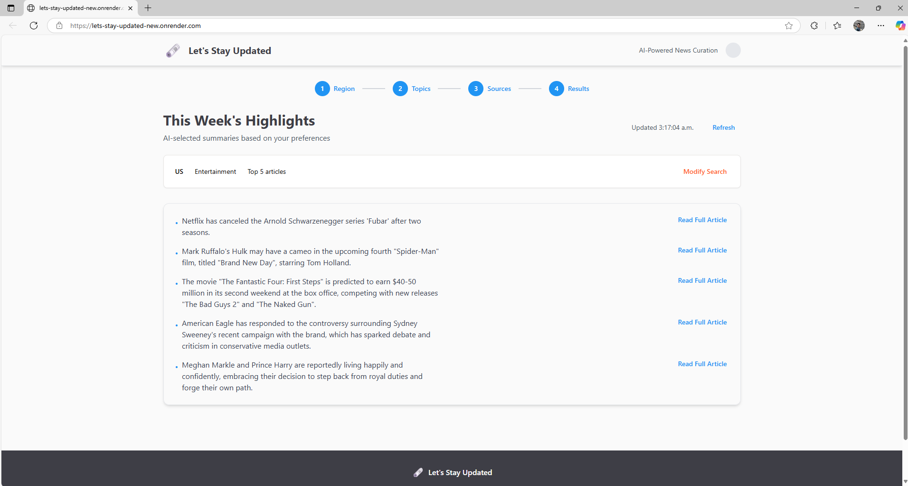

# Let's Stay Updated - AI-Powered News Curation

An intelligent news aggregation platform that uses AI to analyze and rank news articles from various sources. Built with modern technologies and open-source AI models (served via the free-tier Groq API) for cost-effective deployment.

A screen recording and screenshot of the website are included in the `Working_video_images` folder for reference.



---

## 📚 Table of Contents

- [Features](#features)
- [Technology Stack](#technology-stack)
- [Environment Variables](#environment-variables)
- [Installation and Setup](#installation-and-setup)
- [Deployment on Render.com](#deployment-on-rendercom)
- [API Endpoints](#api-endpoints)
- [Usage](#usage)
- [AI Features](#ai-features)
- [Room for Improvement](#room-for-improvement)
- [License](#license)

---

## Features

- **Smart Article Ranking**: AI analyzes and ranks articles by relevance, credibility, and quality  
- **Flexible Topic Selection**: Choose from popular categories or create custom topics  
- **Real-time Curation**: Get fresh, AI-curated news feeds on demand  
- **Cost-Effective**: Uses the free Groq API with generous limits (30 req/min, 1M tokens/hour)  
- **News Aggregation**: Pulls articles from multiple sources using News API  

---

## Technology Stack

### Frontend

- **React 18** with TypeScript  
- **Wouter** for routing  
- **TanStack React Query** for state management  
- **Radix UI** for accessible components  
- **Tailwind CSS** for styling  
- **Vite** for build tooling  

### Backend

- **FastAPI** (Python 3.11+) for ultra-fast async API  
- **Groq API** for LLM-based AI processing (LLaMA 3 70B model)  
- **SQLite** (default) with optional PostgreSQL support  
- **Pydantic** for data validation  

---

## Environment Variables

Create a `.env` file with the following variables:

```env
# Required: Groq API Key for free AI features
GROQ_API_KEY=your_groq_api_key_here

# Required: News API keys (supports multiple for fallback)
NEWS_API_KEY=your_news_api_key_here
NEWS_API_KEY_1=your_news_api_key_1   # additional key to avoid free-tier limits
NEWS_API_KEY_2=your_news_api_key_2   # another fallback key

# Optional: Database connection (SQLite by default)
DATABASE_URL=sqlite:///./news_app.db

# Optional: Application port (default: 5000)
PORT=5000

# Environment settings
ENVIRONMENT=production
LLM_PROVIDER=groq
```

### Getting Your Free Groq API Key

```text
1. Visit https://console.groq.com
2. Sign up for a free account
3. Create an API key in the console
```

---

## Installation and Setup

### Clone the Repository

```bash
git clone https://github.com/PranavKumarAV/Lets-stay-updated
cd Lets-stay-updated
```

### Local Setup with Docker

```bash
# Build the Docker image
docker build -t lets-stay-updated .

# Run the container with your environment variables
docker run -p 5000:5000 --env-file .env lets-stay-updated
```

---

## Deployment on Render.com

### Option 1: One-Click Deploy Using `render.yaml` (Recommended)

```text
1. Connect your GitHub repository to Render
2. The render.yaml file is included in the root directory of this repo.
   Render uses it to auto-deploy the app with pre-configured settings.
3. Add the following environment variables in the Render dashboard:
   - GROQ_API_KEY: Your Groq API key
   - NODE_ENV: production
   - DATABASE_URL: Optional, use default for SQLite
   - LLM_PROVIDER: groq
   - NEWS_API_KEY: Primary News API key
   - NEWS_API_KEY_1: Backup News API key
   - NEWS_API_KEY_2: Another backup News API key
4. Deploy – Render will build and launch your app using Docker.
```

> **Note**: The News API free tier has request/day limits. Use multiple keys for fallback and higher availability.

### Option 2: Manual Web Service Setup on Render

```text
1. Create a new Web Service on Render
2. Connect your GitHub repository
3. Set Dockerfile Path: Dockerfile (default path in root directory)
4. Add environment variables (same as in Option 1)
5. Deploy
```

---

## API Endpoints

- `GET /health` – Health check  
- `POST /api/news/generate` – Generate AI-curated news feed  
- `POST /api/news/sources` – Get recommended sources  
- `GET /api/news/articles` – Fetch cached articles  
- `POST /api/news/cleanup` – Clean up old cached articles  

---

## Usage

```text
1. Choose Region: Select international or region-specific news
2. Select Topics: Choose from Politics, Sports, AI, Movies, or add custom topics
3. Configure Sources: Select number of articles (5–15)
4. Get Results: AI scores and returns the most relevant, credible news
```

---

## AI Features

- **Smart Source Selection**: LLM evaluates best sources for your region and topics  
- **Content Scoring**: Each article is ranked by relevance, quality, and credibility  
- **Personalized Feeds**: Tailored news based on your preferences  
- **Quality Control**: Only high-quality articles are shown  

---

## Room for Improvement

- **LLM-generated sources**: Auto-fetch via RSS instead of NewsAPI (partially implemented)  
- **Mobile App**: A cross-platform companion app  
- **Email Integration**: Scheduled delivery of news via email  
- **Behavioral Personalization**: Learn user interests over time for smarter curation  

---

## License

This project is licensed under the [MIT License](./LICENSE).
